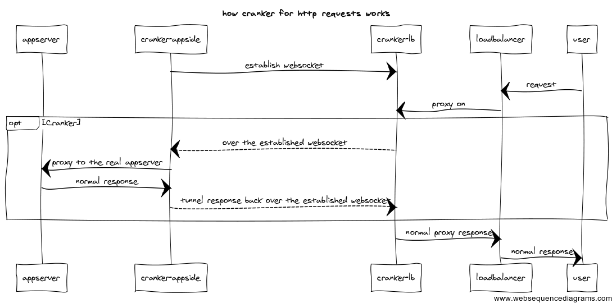
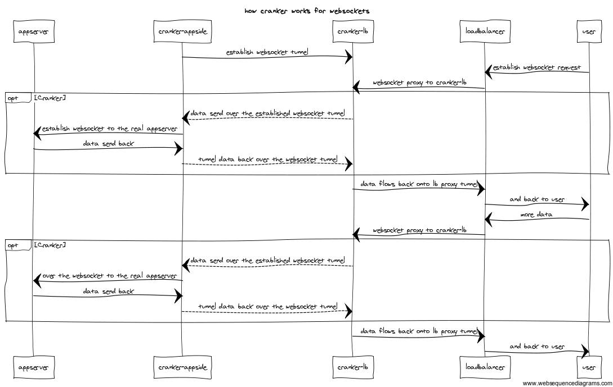

Crank4go API Gateway
=======

Brief Introduction 
-----
It is a Golang implementation of [Crank4j](https://github.com/danielflower/crank4j), which derived from [Cranker](https://github.com/nicferrier/cranker).
 the follow introduction is quoted from the origin project:

It consists of 2 executables that together act as a reverse proxy. What it
allows is for cases where there is a firewall between your inside network and
a [DMZ zone](https://en.wikipedia.org/wiki/DMZ_(computing)).

For a normal reverse proxy, a port would need to be open allowing traffic from
the DMZ to the internal network. Crank4j allows you to reverse this: Just open
a port from the internal network to the DMZ, and Crank4j will tunnel HTTP traffic
over the opened network.

So there are two pieces:

* **The router** that faces the internet, and accepts client HTTP requests
* **The connector** that opens connections to the router, and then passes tunneled
requests to target servers.

The connections look like this:

    Browser      |   DMZ        |    Internal Network
     GET   --------> router <-------- connector ---> HTTP Service
                 |              |

But from the point of view of the browser, and your HTTP service, it just looks
like a normal reverse proxy.


Dive deeper 
---

this 2 picture are quoted from [Cranker](https://github.com/nicferrier/cranker)

HTTP requests with cranker:


Websockets with cranker:




Running locally for test
---------------

### Running from an IDE
1. go mod tidy
2. open `test/e2etest/dryrun_router_test.go` run the test and a router will be started
3. open `test/e2etest/connector_manual_test.go`, a connector and a web-service will be started and connector to the router
4. open `https://localhost:9000` in your browser , it is the side facing to users 
   - `https://localhost:9070/api/registrations` shows the registration status of router
   - `http://0.0.0.0:12439/health` shows the health status of router

### Use it in your project 

#### connector usage
0. `go get -v github.com/torchcc/crank4go`
1. create a web-service with a path prefix (context-path concept in java) e.g. `/my-service/...`
2. start the web-service listening on a random port
3. register your web server with one or more routers:
```go
package main

import (
	"fmt"
	. "github.com/torchcc/crank4go/connector"
	"net/http"
	"net/url"
)
func HelloHandler(w http.ResponseWriter, r *http.Request) {
	fmt.Fprintf(w, "Hello Crank4go")
}

func main() {
	targetURI, _ := url.Parse("http://localhost:5000")
	routerURI, _ := url.Parse("wss://localhost:9070") // should be the port which your Router Registration server listens on

	connectorConfig := NewConnectorConfig2(targetURI, "my-service", []*url.URL{routerURI}, "my-service-component-name", nil).
		SetSlidingWindowSize(2)
	_ = CreateAndStartConnector(connectorConfig)

	http.HandleFunc("/my-service", HelloHandler)
	http.ListenAndServe(":5000", nil)
	// and then you can query your api gateway to access your service. 
	// e.g. if your router listens on https://localhost:9000, then you can access  https://localhost:9000/my-service
}

```


#### router usage

1. here is example of deploying the [API Gateway crank4go router](https://github.com/torchcc/crank4go-router) 
2. if you want more functionalities, you might want to refer to `crank4go/test/e2etest/cranker_with_all_extention_single_service_test.go`


Advantages
----
1. Less dependencies: only use 4 (all of which are quite small and light ): 
`google/uuid`, `gorilla/websocket`, `julienschmidt/httprouter`, `op/go-logging`
2. Horizontally scalable architecture:  
    we can deploy multiple Router instance on the loadBalancer side. 
    Each web-service can be registered to multiple router

3. Multi-language supported:  communication between router and connector is through websocket, so apart from crank4go-connector,
other connectors written by other language can also be registered to Go-router. such as
   1. [java](https://github.com/danielflower/crank4j/tree/master/crank4j-connector)
   2. [python](https://github.com/torchcc/crank4py-connector) (making it convenient to play micro-service with python)
   3. [java script](https://github.com/danielflower/npm-cranker-connector) 
 
 
4. Hooks supported: hooks are preset in the form of plugin and interceptor to monitor the connection activity of router and connector.


### TODO 
1. add request rate control plugin. 